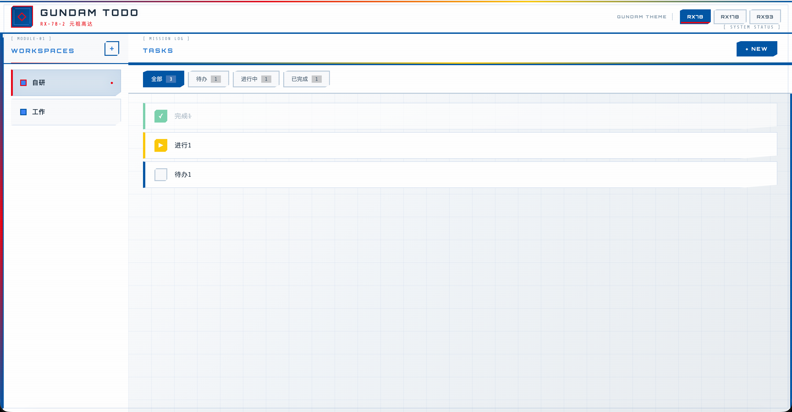

# Gundam Todo

一个高达（Gundam）主题风格的 Todo List Web 应用，支持多工作区管理。



## 功能特性

- **多工作区管理** - 创建、编辑、删除工作区
- **待办事项管理** - CRUD 操作、状态流转
- **三种高达主题** - RX-78-2 / RX-178 Mk-II / RX-93 ν高达
- **机甲驾驶舱 HUD 风格 UI** - 装甲板边框、技术标签、HUD 网格

## 推荐部署方式：使用 AI

> 🤖 **强烈推荐使用 Claude Code 或其他 AI 编程助手来部署本项目**
>
> AI 能够理解项目结构、自动配置环境、处理依赖问题，大大简化部署流程。
>
> 只需将本仓库克隆到本地，然后告诉 AI：
> ```
> "帮我部署这个 Gundam Todo 项目，数据库地址是 xxx，账号 xxx"
> ```
> AI 会自动完成所有配置和启动工作。

详细部署指南请参阅 [DEPLOY.md](./DEPLOY.md)

## 技术栈

| 层级 | 技术 |
|------|------|
| 后端 | Go + Gin + GORM |
| 前端 | React + Vite + TypeScript |
| 数据库 | MySQL |
| UI 风格 | Gundam Mecha Cockpit HUD |

## 人工部署方式

如果你坚持古法编程，不想使用 AI，请参阅 [DEPLOY.md](./DEPLOY.md) 的「人工部署」章节。

## 主题配色

### RX-78-2 元祖高达
白/蓝/红/黄 - 主体白色，经典配色

### RX-178 Mk-II
深蓝/红/黄 - 主体深蓝，泰坦斯风格

### RX-93 ν高达
白/黑/黄/红 - 主体白色，精神感应光晕

## License

MIT